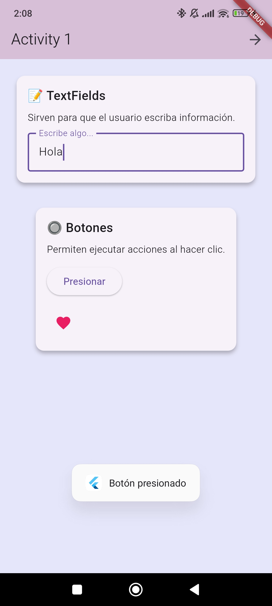
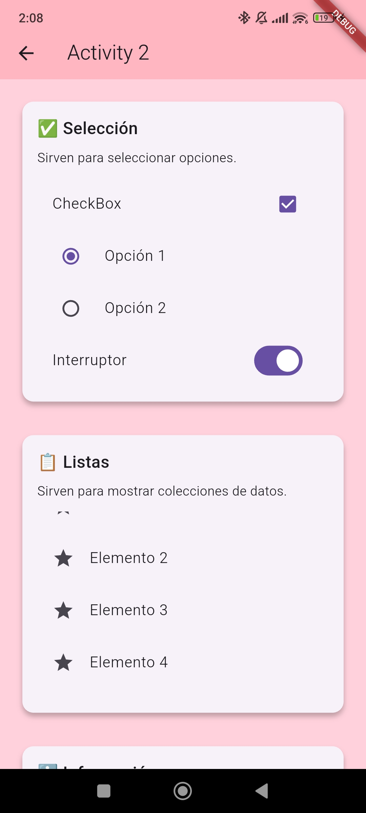
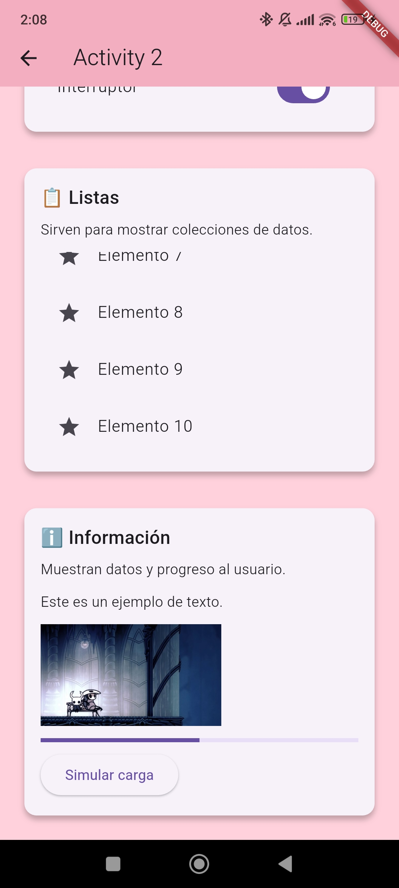
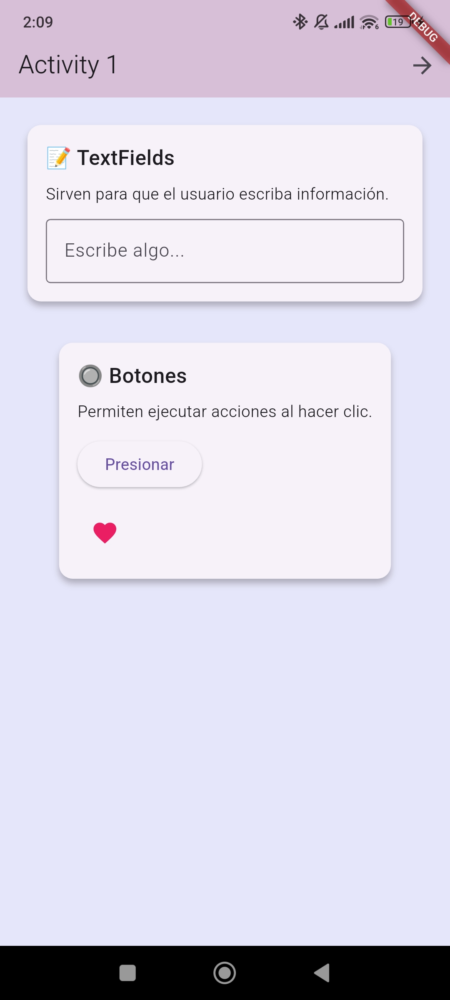
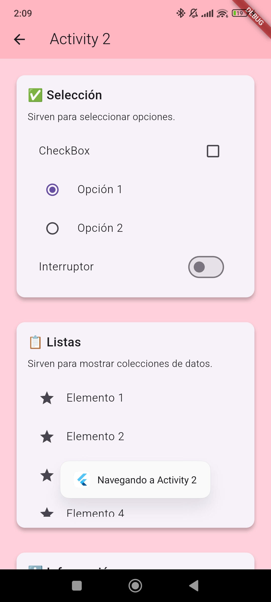

Practica1 Flutter

DESCRIPCIÓN DEL PROYECTO

Este proyecto es una aplicación de demostración de elementos de UI en Flutter.
Contiene dos pantallas (Screens) y cinco Widgets interactivos que muestran:

1. Widget 1: TextFields
   - Entrada de texto editable con título, explicación y demostración interactiva.

2. Widget 2: Botones
   - Botones y botones de imagen que muestran un Toast al ser presionados.

3. Widget 3: Elementos de selección
   - Checkbox, RadioButton y Switch con demostración de selección.

4. Widget 4: Listas
   - Lista de elementos usando ListView con interacción simple.

5. Widget 5: Elementos de información
   - TextView, ImageView y ProgressBar (simulado con CircularProgressIndicator).

La app permite navegar entre las dos pantallas y probar cada Widget de manera interactiva.

El main screen tiene un fondo lavanda, y el segundo screen tiene un fondo rosa pastel.

------------------------------------------------------------

CÓMO EJECUTAR LA APLICACIÓN

Prerrequisitos:
- Tener instalado Flutter en tu máquina.
- Tener un dispositivo Android conectado o un emulador configurado.
- Tener permisos de depuración USB si usas un dispositivo físico.

Pasos:
1. Clona el repositorio o descarga el proyecto.
2. Abre PowerShell o terminal en la carpeta raíz del proyecto.
3. Obtén las dependencias:

   flutter pub get

4. Corre la app en debug:

   flutter run

- Flutter instalará automáticamente la app en tu dispositivo/emulador.
- Durante la primera compilación puede tardar varios minutos.

Opcional: Generar APK para instalar

   flutter build apk --debug

El APK se encontrará en:
build\app\outputs\flutter-apk\app-debug.apk

------------------------------------------------------------

DIFICULTADES ENCONTRADAS Y SOLUCIONES

- Error "zip END header not found" de Gradle:
  Se solucionó eliminando las carpetas corruptas de Gradle en .gradle/wrapper/dists 
  y ejecutando flutter clean y flutter pub get.

- Dependencias de Flutter no compatibles:
  Se actualizaron los paquetes a versiones compatibles con la versión de Flutter usada.

- Problemas de fondo en Widgets según Screen:
  Se adaptó cada Widget para que tome el color de su Screen correspondiente.

------------------------------------------------------------

HALLAZGOS

- Flutter permite reutilizar Widgets fácilmente, similar a los Fragments en Android.
- hot reload facilita probar cambios en tiempo real sin reinstalar la app.
- El manejo de imágenes desde assets o desde red es sencillo con Image.asset e Image.network.
- Diferencias de estilo y colores se pueden aplicar dinámicamente según el Screen usando Container y BoxDecoration.

------------------------------------------------------------
