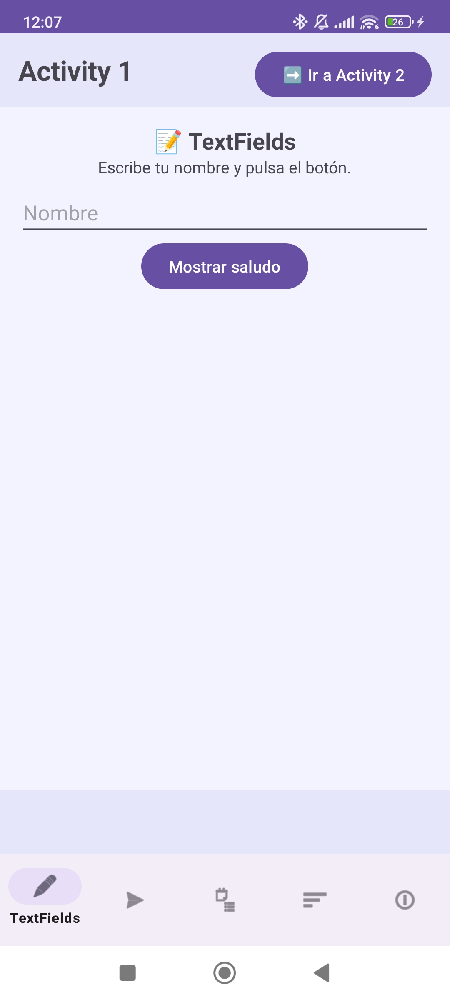
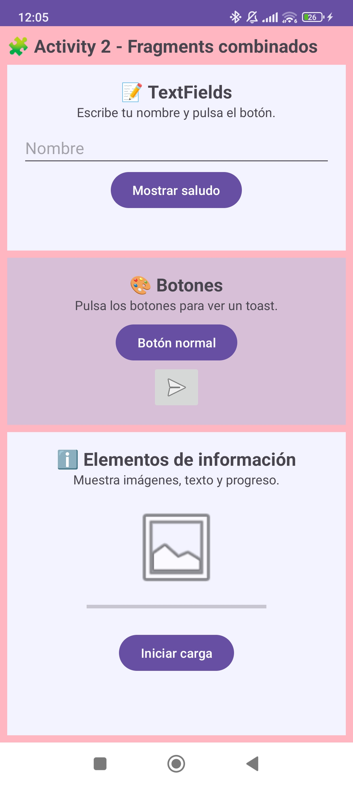
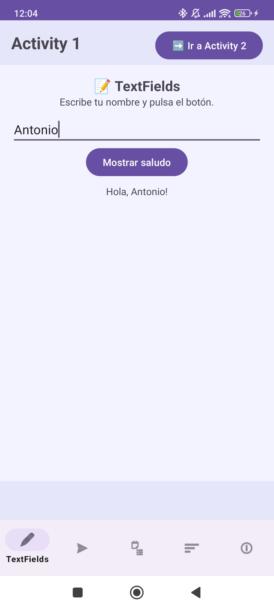
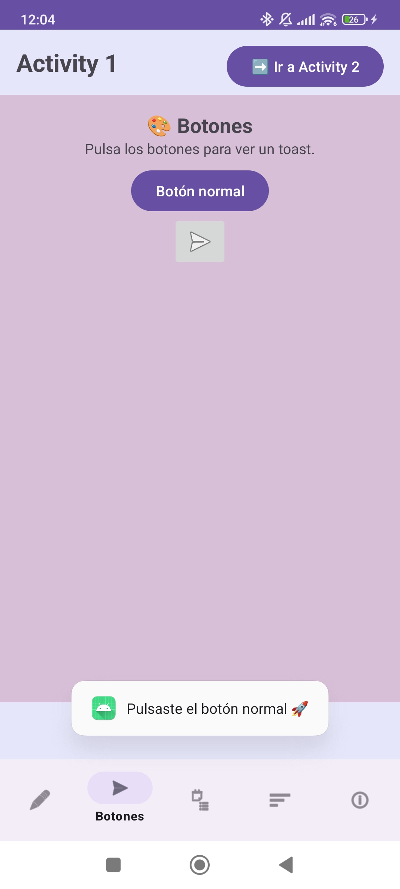
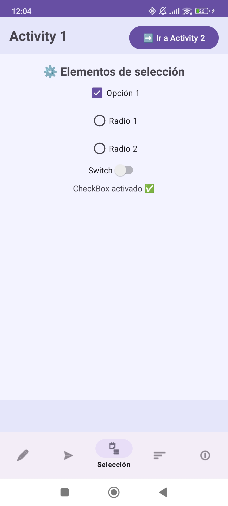
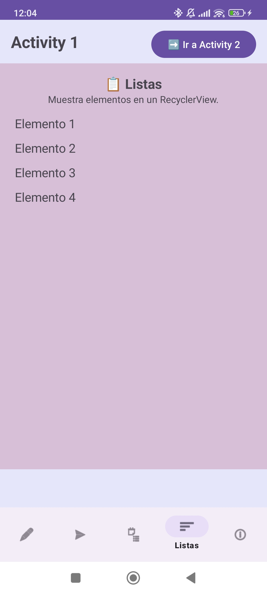
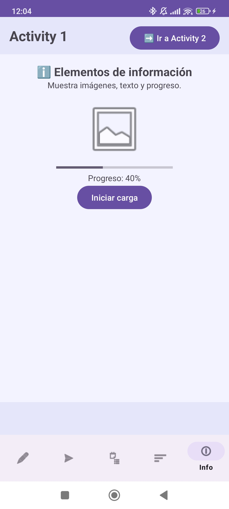

PROYECTO DE APLICACIÓN ANDROID: ACTIVITIES Y FRAGMENTS INTERACTIVOS

DESCRIPCIÓN DEL PROYECTO
------------------------
Este proyecto es una aplicación Android desarrollada en Kotlin que demuestra el uso de Activities y Fragments interactivos con distintos elementos de interfaz de usuario.

La aplicación contiene:

2 Activities:
- MainActivity (lavanda): muestra fragments individualmente con navegación mediante BottomNavigation.

- SecondActivity (rosa pastel): muestra varios fragments combinados en una misma pantalla.

5 Fragments:
1. Fragment1 (TextFields): campos de texto editables con interacción de botones.

2. Fragment2 (Botones): botones normales e ImageButton con feedback mediante Toast.

3. Fragment3 (Elementos de selección): CheckBox, RadioButton y Switch interactivos.

4. Fragment4 (Listas): RecyclerView o ListView para mostrar listas.

5. Fragment5 (Elementos de información): TextView, ImageView y ProgressBar simulando carga.

Los fragments son adaptativos, cambiando su color de fondo según la Activity donde se cargan, logrando una experiencia visual coherente.

INSTRUCCIONES PARA EJECUTAR Y PROBAR LA APLICACIÓN
--------------------------------------------------
1. Clonar el repositorio:
   git clone <URL_DEL_REPOSITORIO>

2. Abrir el proyecto en Android Studio (versión recomendada: Arctic Fox o superior).

3. Sincronizar Gradle si es necesario (File -> Sync Project with Gradle Files).

4. Ejecutar la aplicación en un emulador Android o un dispositivo físico conectado.

5. Explorar las funcionalidades:
   - Navegar entre fragments usando la BottomNavigation en MainActivity.
   - Probar los TextFields y botones de Fragment1 y Fragment2.
   - Ver los elementos de selección y listas en sus fragments correspondientes.
   - Abrir SecondActivity usando el botón y observar los fragments combinados con colores adaptativos.
   - Pulsar los botones en cualquier Activity para ver los Toasts.

DIFICULTADES ENCONTRADAS Y SOLUCIONES
-------------------------------------
1. Adaptar fragments a múltiples Activities:
   - Problema: Teníamos que duplicar layouts para cada Activity por los colores.
   - Solución: Se implementó un setter "setBackgroundColor()" en cada fragment para cambiar el color dinámicamente según la Activity donde se cargue.

2. Mostrar Toasts de Fragment2 en ambas Activities:
   - Problema: Los Toast solo funcionaban en la Activity que implementaba la interfaz inicialmente.
   - Solución: Se definió la interfaz OnButtonClickListener y ambas Activities la implementan, de modo que Fragment2 pueda notificar a cualquier Activity donde se cargue.

3. Mantener navegación y layout limpio:
   - Problema: La BottomNavigation y la navegación entre fragments necesitaban integrarse con los botones de cambio de Activity.
   - Solución: Se utilizó ConstraintLayout y un FrameLayout para el contenedor de fragments, manteniendo una disposición clara y adaptable.

HALLAZGOS
---------
- Los fragments son reutilizables si se parametrizan correctamente con colores y callbacks.
- La navegación entre fragments y Activities se puede combinar con BottomNavigation y botones sin conflictos.
- Android permite interactividad dinámica en los fragments, mostrando que es posible construir pantallas complejas sin duplicar código.
- Usar colores adaptativos y layouts modulares mejora la experiencia visual y la mantenibilidad del proyecto.

LICENCIA
--------
Este proyecto es educativo y se puede usar como base para aprender el manejo de Activities y Fragments en Android con Kotlin.
