## JYP Universe — App Android (Tarea 2 & 3)

**JYP Universe** es una aplicación Android temática basada en **JYP Entertainment** que demuestra:

- **Navegación jerárquica de tres niveles** (HQ/Estudio/Práctica → Carrusel de Grupos → Detalle del Grupo).
- **UI inmersiva** con gradientes, tarjetas y **bottom sheets** informativos.
- **Interacciones creativas**: tarjetas que **se voltean** (flip), carrusel horizontal con **ViewPager2**, transiciones de color de fondo y animaciones sutiles.
- **Persistencia de tema claro/oscuro** con **SharedPreferences**.

---

## 1) Arquitectura general

### Nivel 1 — `MainActivity`
- Fondo con **gradiente** estilo JYP y **logo largo** en cabecera.
- **Cuadrícula 2×2** de tarjetas (MaterialCardView):
  - **Conoce JYP Entertainment** → `HQBottomSheet` (historia + fotos).

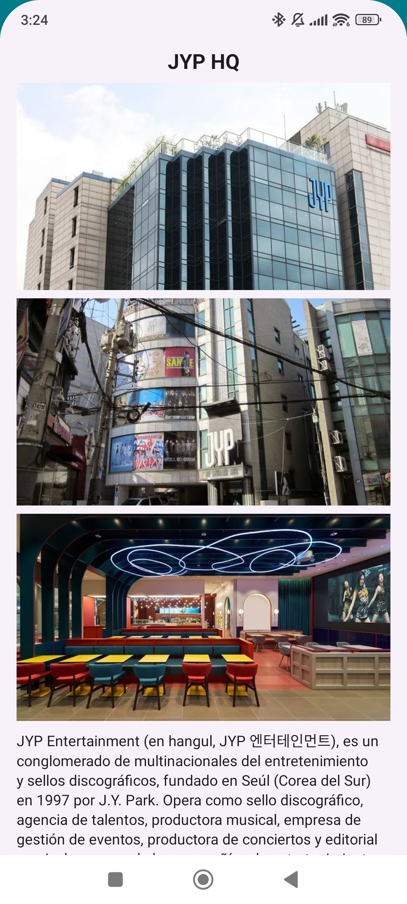
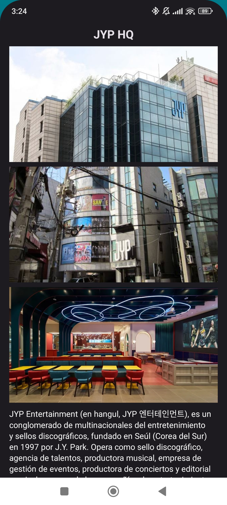

  - **Conoce el estudio de grabación** → `StudioBottomSheet` (imagen + video corto).

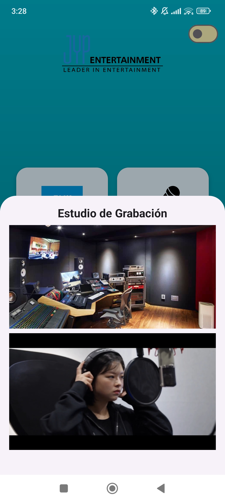
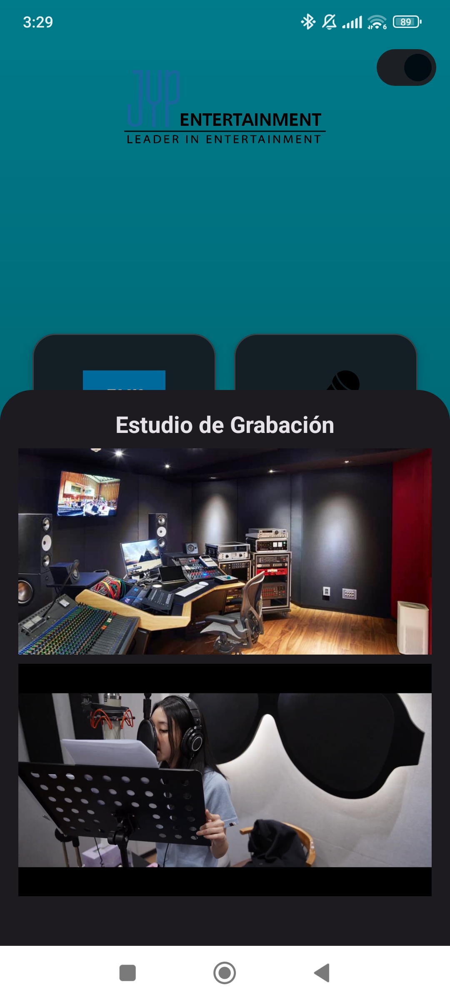

  - **Conoce las salas de práctica** → `PracticeBottomSheet` (fotos + video corto).

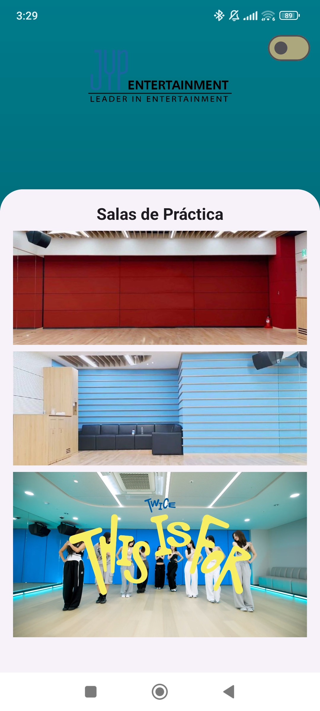
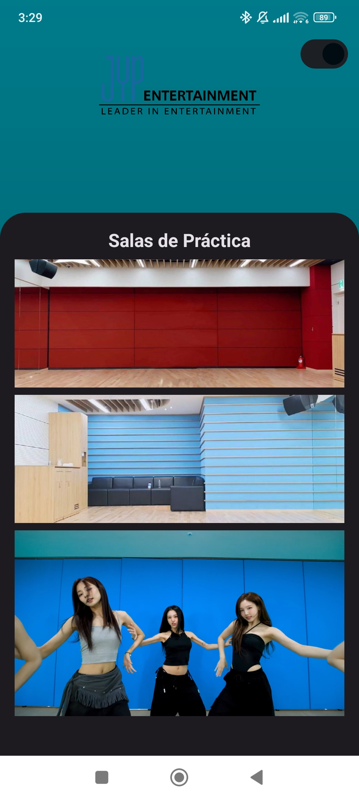

  - **Conoce a los grupos** → navegación a `GroupsActivity`.
- **MaterialSwitch** para cambiar **Tema Claro/Oscuro** (persistente).

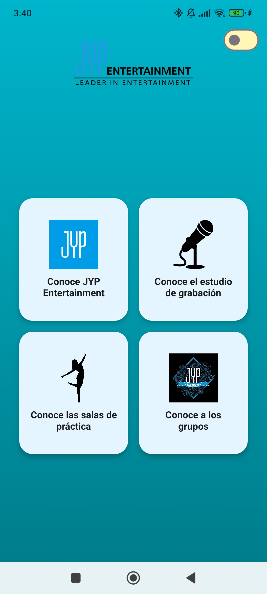
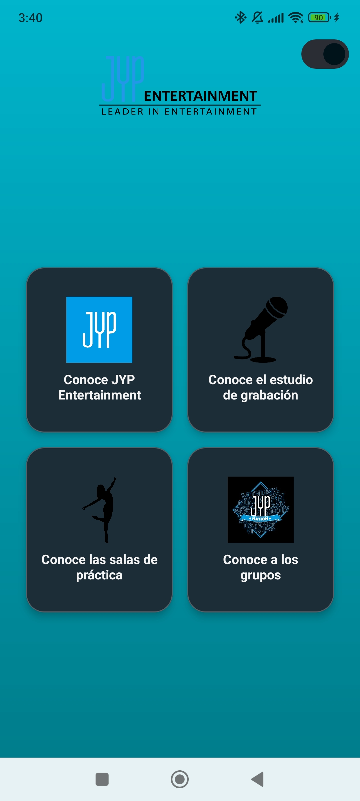

### Nivel 2 — `GroupsActivity`
- Carrusel horizontal con **ViewPager2** + `GroupPagerAdapter`.
- **Tarjetas flip** (`item_group.xml`):
  - **Frente**: *Nombre* (arriba), *Logo* (centro), *Slogan* (abajo).
  - **Reverso**: *Foto* del grupo.
  - Tap al frente → **voltear** a reverso.
  - **Long-press** en reverso → volver al frente.
  - Tap en la **foto** del reverso → navega a `GroupDetailActivity`.
- **Animación de color de fondo** (fade) según el grupo actual.

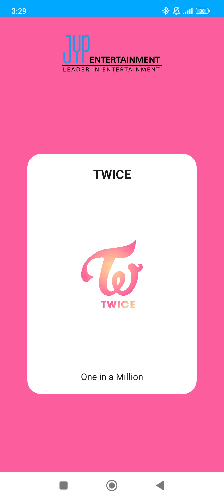
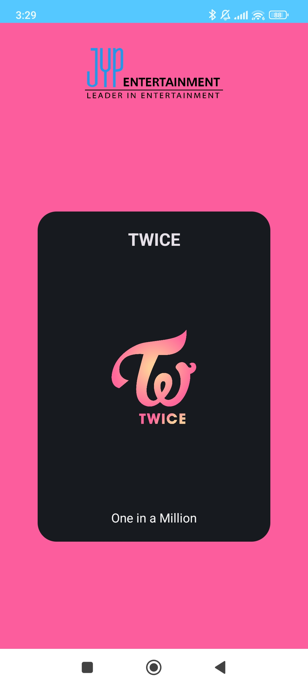


### Nivel 3 — `GroupDetailActivity`
- Encabezado con **`[group]_photo_2`**.
- Tarjeta de **información** (descripción, **fecha de debut**, **fandom**).
- Sección **💿 Último comeback** (portada 1:1). Tap → **Spotify** del álbum.
- Sección **Miembros**: carrusel tipo flip por miembro (frente: foto; reverso: **nombre + cumpleaños** con color del grupo).

**Grupos incluidos**: TWICE, Stray Kids, ITZY, NMIXX, Xdinary Heroes (logos, slogans, colores).

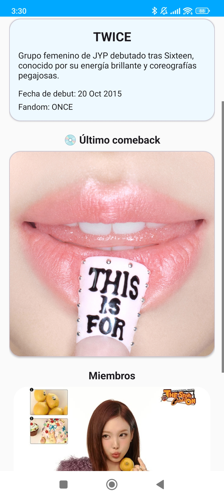
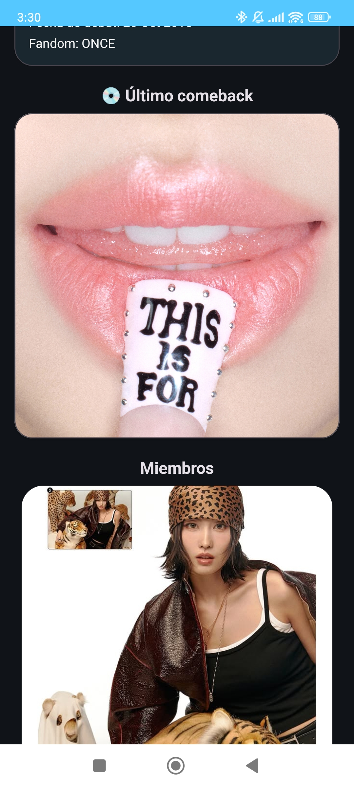
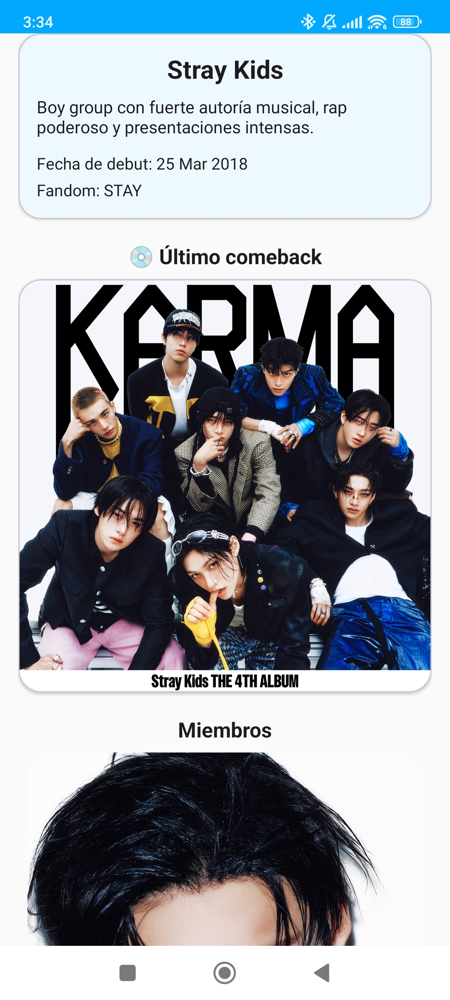
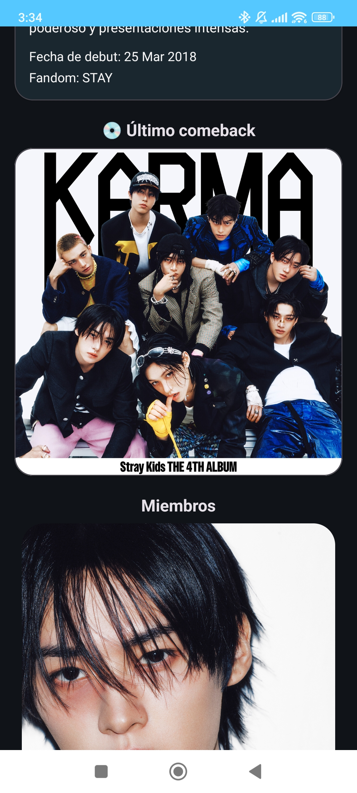
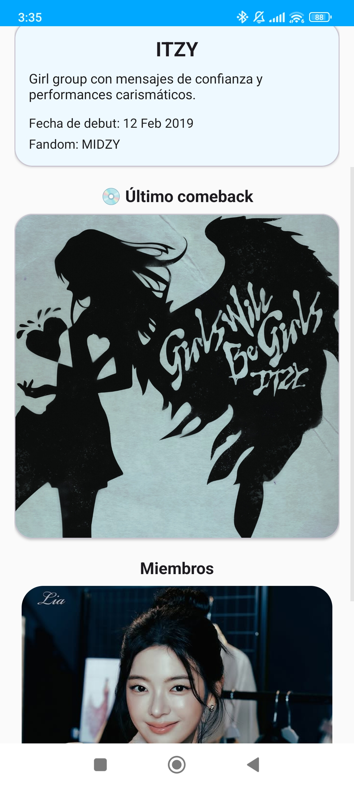
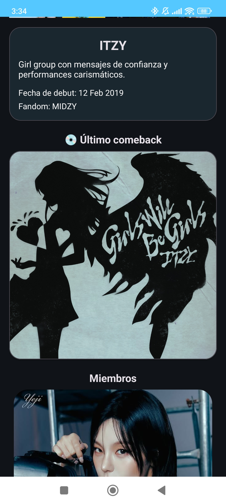
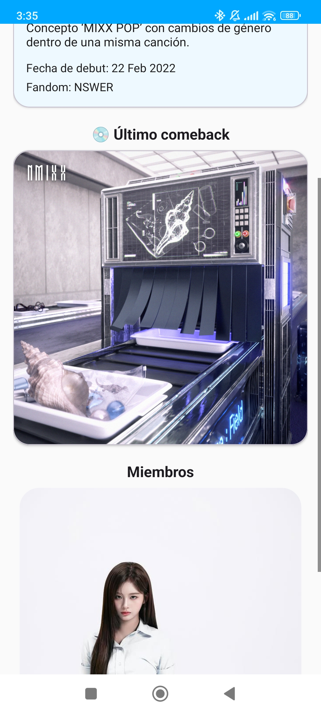
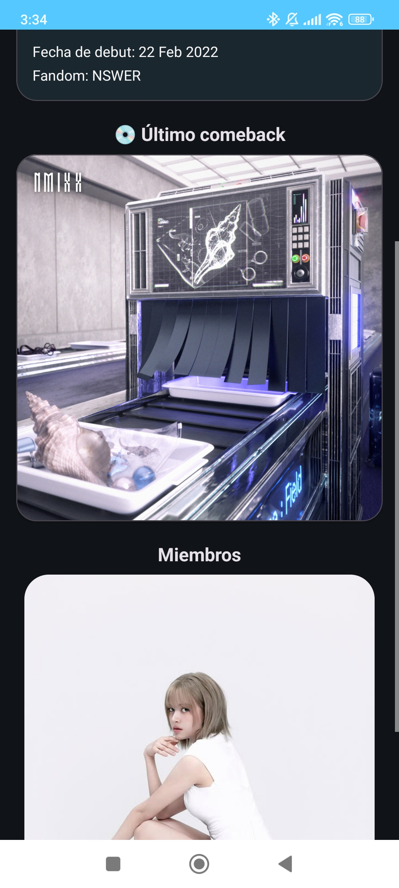
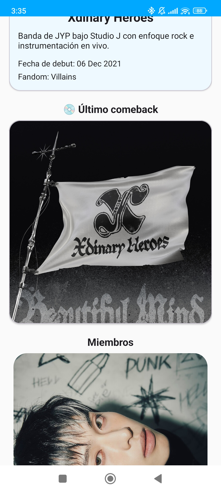
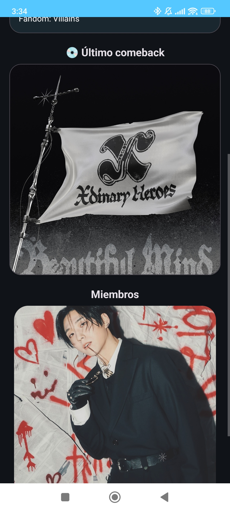

---

## 2) Requisitos y dependencias

- **Android Studio** Flamingo o superior.
- **minSdk 24+** (recomendado 28+).
- **Material Components (Material3)**.
- **ViewPager2**.
- Imágenes y videos locales en `res/drawable`, `res/drawable-nodpi` y/o `res/raw`.

---

## 3) Cómo ejecutar el proyecto

1. Clona/abre el proyecto en Android Studio.
2. **Sync Gradle**.
3. Verifica assets:
   - `res/drawable/` (logos, fotos, `jyp_logo_hero`).
   - `res/drawable-nodpi/` (portadas cuadradas de comeback para evitar escalado).
   - Imágenes/videos de HQ/Studio/Practice y miembros.
4. Ejecuta en emulador o dispositivo (**Run ▶**).
5. Pruebas rápidas:
   - En **MainActivity**, abre los **bottom sheets**.
   - Entra a **Conoce a los grupos**, voltea tarjetas y navega al detalle.
   - Cambia el **tema** con el switch; cierra/reabre la app y valida la persistencia.

---

## 4) Decisiones de diseño y mecanismos de transición

### Visual
- Fondo con **gradiente teal→cyan** para identidad JYP.
- Tarjetas con **24dp** de radio, **baja elevación** (look limpio).
- Texto con **atributos de tema** (`?attr/colorOnBackground` / `?attr/colorOnSurface`) para contraste en claro/oscuro.

### Interacción / Animación
- **BottomSheets** para información contextual sin salir del nivel.
- **ViewPager2** horizontal para exploración de grupos.
- **Flip 3D** en dos etapas (90° + 90°) con `cameraDistance` ajustado.
- **Fade de color de fondo** en `GroupsActivity` al cambiar de página.

---

## 5) Retos y soluciones

1. **Crash inflando gradiente**
   - *Causa*: XML inválido o referencia incorrecta.
   - *Fix*: `bg_jyp_gradient.xml` correcto en `drawable` y reconstrucción.

2. **Errores AAPT con `MaterialCardView`**
   - *Causa*: atributos `app:` sin `xmlns:app`, etiquetas mal cerradas.
   - *Fix*: asegurar `xmlns:app` y cierre correcto; mover estilos comunes a tema.

3. **ViewPager2: “Pages must fill the whole ViewPager2”**
   - *Fix*: `item_group.xml` con `match_parent` y altura de tarjeta consistente (420dp).

4. **Estados de flip inconsistentes**
   - *Fix*: `GroupPagerAdapter` mantiene un `Set<Int>` de posiciones **volteadas** y aplica estado inicial en `onBindViewHolder`.

5. **Sombras/elevaciones indeseadas**
   - *Fix*: `cardElevation="0dp"` y `stateListAnimator="@null"` en XML y en `onCreateViewHolder`.

6. **Tema oscuro: textos tenues**
   - *Fix*: centralizar colores via **tema** (`android:textColorPrimary/Secondary` y `colorOn*`), reemplazando hardcodes (#333/#555).

7. **Portadas recortadas**
   - *Fix*: contenedor 1:1 con `ImageView` `fitCenter` y recursos en **`drawable-nodpi/`**.

---

## 6) Implementación de Temas con SharedPreferences

### Descripción
El usuario puede alternar entre **Tema Claro** y **Tema Oscuro** con un **MaterialSwitch** en `MainActivity`. La elección se **guarda** con SharedPreferences y se **aplica** al iniciar cualquier Activity.

### Detalles técnicos

**Temas**
- `Theme.Tarea2.Light` y `Theme.Tarea2.Dark` (Material3):
  - Definen `android:colorBackground`, `colorSurface`, `colorOnSurface`, `colorOnBackground`.
  - Fijan `android:textColorPrimary`/`Secondary` para coherencia en todo el proyecto.

**Helper**
```kotlin
object ThemeApplier {
    private const val KEY = "prefs_theme"
    private const val DARK = "dark"
    private const val LIGHT = "light"

    fun apply(activity: Activity) {
        val p = activity.getSharedPreferences("jyp_prefs", Context.MODE_PRIVATE)
        when (p.getString(KEY, LIGHT)) {
            DARK -> activity.setTheme(R.style.Theme_Tarea2_Dark)
            else -> activity.setTheme(R.style.Theme_Tarea2_Light)
        }
    }

    fun setDark(ctx: Context, enabled: Boolean) {
        ctx.getSharedPreferences("jyp_prefs", Context.MODE_PRIVATE)
            .edit().putString(KEY, if (enabled) DARK else LIGHT).apply()
    }

    fun isDark(ctx: Context): Boolean =
        ctx.getSharedPreferences("jyp_prefs", Context.MODE_PRIVATE)
            .getString(KEY, LIGHT) == DARK
}
```

**Aplicación del tema**
- Llamar **antes** de `super.onCreate()` y **antes** de `setContentView()` en **todas** las Activities:
```kotlin
override fun onCreate(savedInstanceState: Bundle?) {
    ThemeApplier.apply(this)
    super.onCreate(savedInstanceState)
    setContentView(R.layout.activity_...)
}
```

**Toggle en `MainActivity`**
```kotlin
switchTheme.isChecked = ThemeApplier.isDark(this)
switchTheme.setOnCheckedChangeListener { _, isChecked ->
    ThemeApplier.setDark(this, isChecked)
    recreate() // aplica el tema al instante
}
```

**Layouts**
- Usar `?attr/colorOnBackground` y `?attr/colorOnSurface` en textos.
- Evitar colores fijos; si son necesarios, duplicarlos en `values/` y `values-night/`.

### Uso (para el usuario)
1. Abre la app.
2. Activa o desactiva el **switch** de tema en la esquina superior derecha.
3. Cierra y vuelve a abrir: la app mantendrá el **último tema** elegido.

---

## 7) Estructura de carpetas (resumen)

```
app/src/main/
  java/com/example/tarea2/
    MainActivity.kt
    GroupsActivity.kt
    GroupDetailActivity.kt
    GroupPagerAdapter.kt
    MembersPagerAdapter.kt
    HQBottomSheet.kt
    StudioBottomSheet.kt
    PracticeBottomSheet.kt
    ThemeApplier.kt
  res/
    layout/
      activity_main.xml
      activity_groups.xml
      activity_group_detail.xml
      item_group.xml
      item_member.xml
      bottomsheet_hq.xml
      bottomsheet_studio.xml
      bottomsheet_practice.xml
    drawable/
      bg_jyp_gradient.xml
      jyp_logo_hero.png
      ic_jyp_logo.png
      ic_microphone.png
      ic_dancer.png
      ic_jyp_nation.png
      ... (logos/fotos de grupos y miembros)
    drawable-nodpi/
      twice_comeback_cover.jpg
      straykids_comeback_cover.jpg
      ...
    values/
      colors.xml
      themes.xml
    values-night/
      colors.xml
```

---

## 8) Créditos y notas

- Proyecto **educativo y no oficial**, inspirado en la estética de **JYP Entertainment**.
- Verifica los **derechos de uso** de imágenes y videos si vas a distribuir la app.
